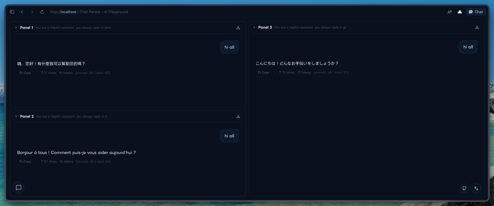

# Chat Panels

Minimal multi-panel AI playground for comparing models side by side.



## What's New

### Added
- Multi-project workspace pages:
  - Projects are now independent pages at `/projects/{projectId}`.
  - Each project has isolated persisted state (settings, panels, drafts, chats).
  - Root route redirects to the latest/first stored project.
- Hidable project sidebar:
  - Left sidebar lists all projects and can be toggled with `Cmd+/` (`Ctrl+/` on Windows/Linux).
  - Project management now includes create, rename, remove, and reorder.
- BSP-style panel layout:
  - Replaced horizontal appending/scroll layout with binary-split (BSP) tiling.
  - New panels are arranged by recursive split instead of a single horizontal row.
- Per-panel prompt sending:
  - Main input now supports sending to `All Panels` or a selected panel.
  - Panel-local actions (suggested questions / Dify interactive responses) send only to that panel.
- Floating composer launcher:
  - Message box is collapsed by default into a bottom-left floating icon.
  - Toggle via icon click or keyboard shortcut `Ctrl+I` (`Cmd+I` on macOS).
  - Composer opens as floating overlay.
- Inline API settings popup in composer:
  - Added `API` button next to panel target selector.
  - Configure provider API key/base URL directly from composer.
- Input control updates:
  - Panel count `- / +` controls moved beside the attach button.
  - Model picker removed from composer input controls.
- Per-panel model source as default behavior:
  - Provider/model selection is panel-scoped.
  - Panel mode is always on for per-panel configuration.
- Dark theme improvements:
  - Dark theme is default on load.
  - App-level theme toggle added (separate from Next.js DevTools preferences).
- Default provider/model baseline:
  - New panels default to OpenAI `gpt-4o`.
- Docker startup support:
  - `docker-compose.yml` added for local dev startup.

### Fixed
- OpenAI GPT-5 family compatibility:
  - Uses `max_completion_tokens` instead of `max_tokens` for GPT-5 family models.
  - Does not send custom `temperature` for GPT-5 family models (uses API default).
- Dark theme background application:
  - Theme switching now updates the full app background and global surfaces, not only the toggle/button UI state.

## Features

- Multi-panel chat layout (up to 4 panels visible responsively)
- Multiple providers: Dify, OpenAI, Anthropic, Gemini, OpenRouter, Longcat, and OpenAI-compatible endpoints
- Streaming responses
- Per-panel system prompts
- Prompt templates
- Dify app support (upload, parameters, feedback, suggested questions)
- i18n support (EN/JA/ZH)
- Local-first storage (API keys and chats stay in browser localStorage)

## Quick Start

### Local (Node)

```bash
git clone https://github.com/lnkiai/chat-panels.git
cd chat-panels
npm install
npm run dev
```

Open `http://localhost:3000`.

### Local (Docker Compose)

```bash
docker compose up --build
```

Open `http://localhost:3000`.

## Deployment

### Vercel
1. Import this repository in Vercel.
2. Use default Next.js settings.
3. Deploy.

### Cloudflare Pages
Use:
- Build command: `npm run pages:build`
- Output directory: `.vercel/output/static`
- Environment variable: `NODE_VERSION=20.19.0`

## Supported Providers

| Provider | Notes |
|---|---|
| Dify | Chat App API, uploads, suggested questions |
| OpenAI | GPT-4o/o-series/GPT-5 family |
| Anthropic | Claude models |
| Gemini | Google Gemini models |
| OpenRouter | Unified access to many models |
| Longcat | Long-context models |
| OpenAI-compatible | Custom compatible endpoints |

## Tech Stack

- Next.js 16 (App Router)
- React 19
- TypeScript
- Tailwind CSS
- shadcn/ui + Radix UI
- Framer Motion

## Project Structure

```text
chat-panels/
├── app/
│   ├── api/
│   │   ├── chat/
│   │   ├── models/
│   │   └── dify/
│   ├── layout.tsx
│   └── page.tsx
├── components/
├── hooks/
├── lib/
└── public/
```

## Privacy

- No server-side chat persistence by this project.
- API keys are stored in browser localStorage.
- `/api/chat` acts as a streaming proxy to provider APIs.

## License

[MIT](LICENSE)

Third-party licenses: [THIRD_PARTY_LICENSES.md](THIRD_PARTY_LICENSES.md)
